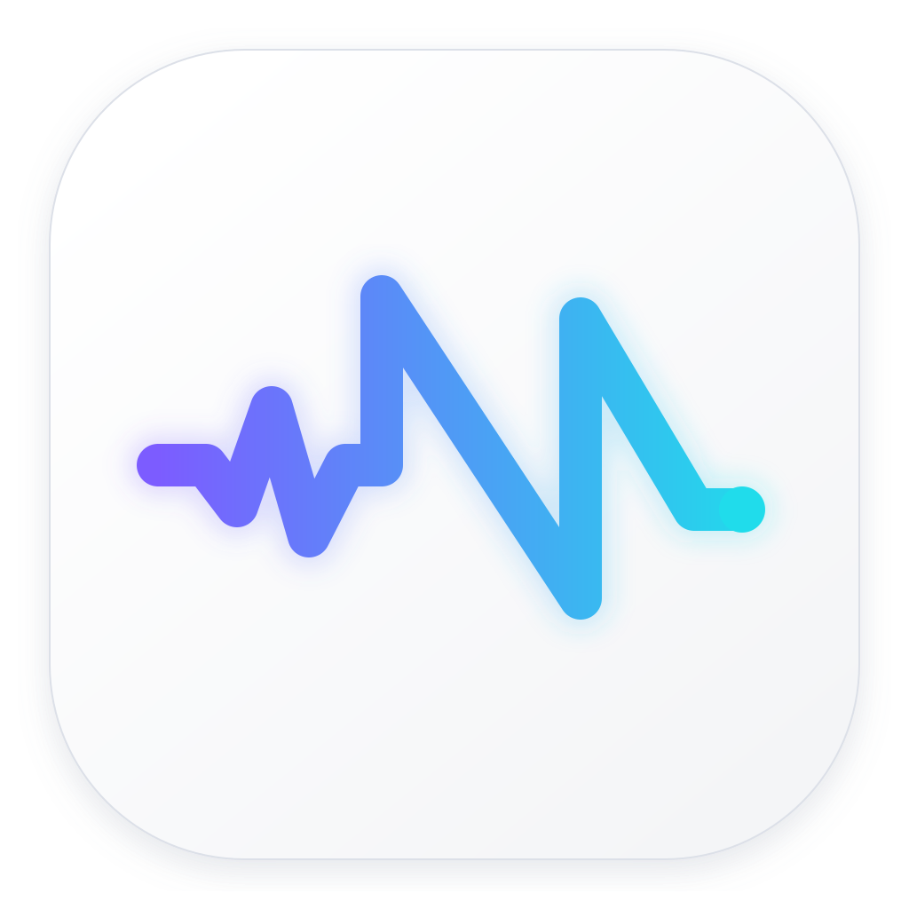

<p align="center">
  
</p>

<h1 align="center">Nelyr</h1>

<p align="center"><strong>Your local input layer.</strong></p>
<p align="center">Speak anywhere. Keep what matters.</p>

Nelyr is a native, privacy-first macOS input layer that turns voice, selected
text, screenshots, and passing thoughts into useful Obsidian knowledge.

It is built for the moment between having an idea and losing it: summon Nelyr
from any app, speak or paste what is on your mind, and let local models turn it
into a structured note without taking ownership of your data.

## What it does

- Global Quick Capture from any app
- Multilingual on-device dictation with WhisperKit
- Hold-to-talk or press-to-start/stop voice input
- System-wide dictation, translation, and voice editing
- Right-click capture through macOS Services
- Screenshot paste, drag-and-drop, and local Japanese/English OCR
- Structured Obsidian notes for ideas, goals, life plans, observations, and
  reflections
- Local Ollama summaries, classification, hashtags, and related-note links
- Optional cited web research through the Grok CLI
- Morning planning, priorities, focus timer, notifications, and widgets
- Caps Lock display-sleep prevention

## Local by default

Ordinary captures, screenshots, recordings, transcripts, settings, and notes
stay on your Mac.

- WhisperKit transcribes locally and the temporary recording is discarded.
- Apple Vision performs OCR locally.
- Ollama is contacted only through `127.0.0.1:11434`.
- Web access occurs only when you explicitly trigger a research action.
- Your Obsidian vault remains a normal folder of Markdown files.

The initial WhisperKit and Ollama model downloads require an internet
connection.

## Community and Pro

Nelyr Community is MIT-licensed and is designed to remain genuinely useful:
local dictation, global capture, Whisper transcription, OCR, history, Obsidian
Inbox capture, local Ollama enrichment, and the external research bridge are
not metered.

The planned optional Pro layer adds higher-order workflows such as a deeper
knowledge graph, agentic related-note discovery, advanced OCR pipelines,
multiple vaults, managed model installation, polished signed releases, and
automatic updates. Pro is an injected capability layer; the Community capture
path does not depend on it, and the raw thought is saved before enrichment
runs.

See [the product design](docs/nelyr-product-design.md) and
[implementation plan](docs/nelyr-implementation-plan.md).

## Requirements

- macOS 14 or newer
- Apple Silicon
- Xcode 16.3 or newer (Swift 6.1)
- [XcodeGen](https://github.com/yonaskolb/XcodeGen) for the app and widget build
- [Ollama](https://ollama.com/) for optional local note enrichment
- An Obsidian vault

## Build from source

```sh
git clone https://github.com/Jaywantstocode/nelyr.git
cd nelyr
swift test
```

Build a standalone app without the WidgetKit extension:

```sh
NELYR_SIGN_IDENTITY="YOUR_SIGNING_IDENTITY_OR_SHA1" \
  ./scripts/build-app.sh

open "outputs/Nelyr.app"
```

Build the complete app and widget:

1. Replace the Apple development team, bundle identifiers, and App Group
   identifier in `project.yml` and `config/*.entitlements` with identifiers
   from your Apple Developer account.
2. Generate and build:

```sh
xcodegen generate
./scripts/build-signed-app.sh
open "outputs/Nelyr.app"
```

The repository contains the maintainer's public signing identifiers so the
release configuration is reproducible. It does not contain a certificate,
private key, provisioning profile, model, vault, or other secret.

## First run

1. Move Nelyr to `/Applications` and open it.
2. In Settings, choose an Obsidian vault. Nelyr creates `Ideas` and
   `Attachments` folders inside it.
3. Install the suggested Ollama models if you want local summaries, tags, and
   related-note links.
4. In **Settings → Voice**, install a multilingual Whisper model.
5. Allow microphone access. Accessibility access is optional and enables
   direct text insertion into other apps.
6. Allow notifications if you want planning and focus alerts.

For right-click capture, enable the Nelyr actions under **System Settings →
Keyboard → Keyboard Shortcuts → Services → Text** if macOS does not show them
automatically.

## Default shortcuts

| Action | Shortcut |
| --- | --- |
| Quick Capture | `Control–Option–Space` |
| Dictate anywhere | `Control–Shift–Space` |
| Translate dictation | `Control–Shift–T` |
| Voice-edit selection | `Control–Shift–E` |
| Voice web research | `Control–Shift–R` |

Voice shortcuts are configurable in the app.

## Upgrade compatibility

Nelyr intentionally retains several legacy `DailyDesk` internal identifiers.
They preserve macOS privacy permissions, login behavior, UserDefaults,
downloaded models, widget data, and the existing Application Support folder
when upgrading from Daily Desk. Both `nelyr://` and `dailydesk://` links are
accepted.

## Project structure

```text
Sources/DailyDesk/        Main Nelyr SwiftUI/AppKit application
Sources/DailyDeskWidget/  Nelyr WidgetKit extension
Tests/DailyDeskTests/     Unit and integration tests
config/                   Entitlements and widget metadata
scripts/                  Build, icon, and packaging scripts
docs/                     Product and architecture notes
project.yml               XcodeGen project definition
```

The legacy source-folder names are retained during the compatibility migration;
the public products and Swift module are named Nelyr.

## Dependencies

- [WhisperKit / Argmax OSS Swift](https://github.com/argmaxinc/argmax-oss-swift)
- [KeyboardShortcuts](https://github.com/sindresorhus/KeyboardShortcuts)
- [Ollama](https://ollama.com/) as an optional local runtime
- Apple Vision, SwiftUI, AppKit, WidgetKit, and UserNotifications

## Contributing

Issues and pull requests are welcome. Before opening one, run:

```sh
swift test
```

Do not commit signing certificates, provisioning profiles, model files,
Obsidian vault contents, or personal app data.

## License

Nelyr Community is available under the [MIT License](LICENSE).
